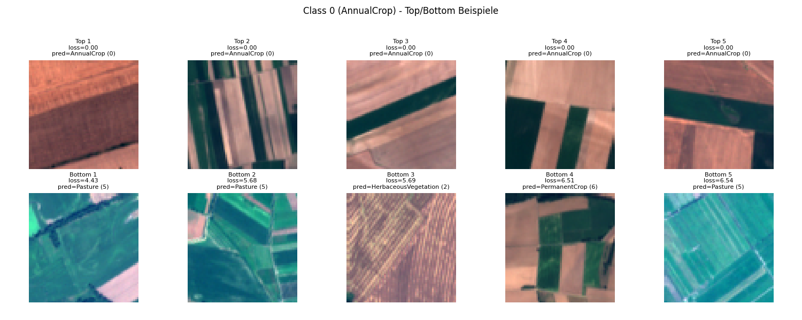
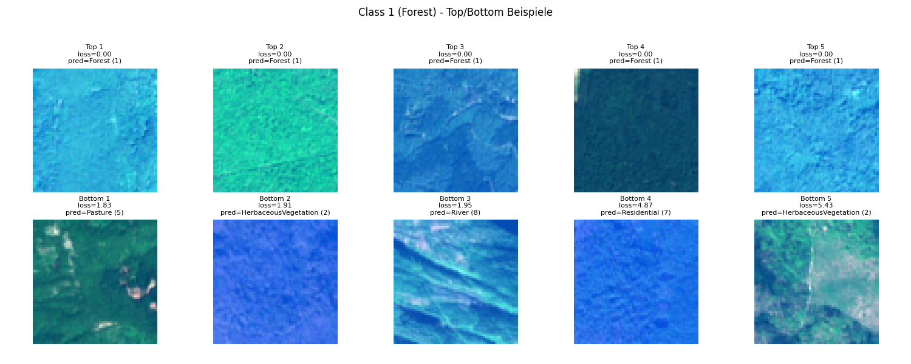
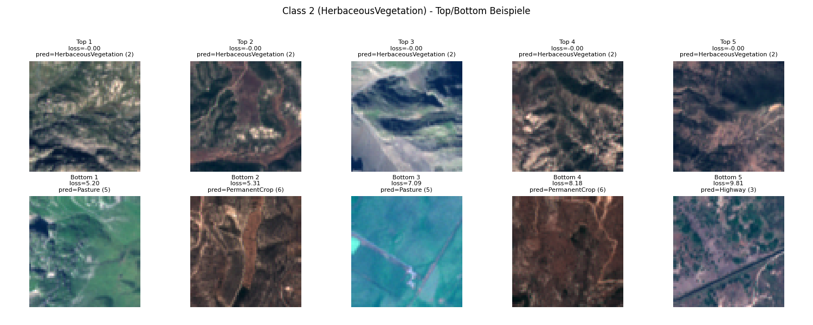

# Mandatory task WS 25/26 - Deep Learning for Master Students

## Participants
- Lukas Marche - 
- Robin Berge - 
- Jonas Clauß - 3792567

## Config Parameters:
In our project we have three different levels to set the parameters.
1. The default config:
    If none of the other levels is set the project runs with these default settings. These parameters can be found in the `helpers/config.py` file. Please don't change these settings.
2. The `config.json`file:
    In this config file you can choose your own parameters which override the default configs. The structure needs to look like this. Alle possible values are listed below:
    ```json
    {
        "seed": 3792567, // Seed for all RNGs (e.g. matriculation number).
        "project_path": ".", // Base project path; data paths are resolved relative to this.
        "data_path": "./data/EuroSAT_RGB", // Path to dataset root (e.g. ./data/EuroSAT_RGB or ./data/EuroSAT_MS)
        "data_source": {"rgb", "ms"}, // Image source to use (*rgb* or *ms*). 
        "epochs": 15, // Number of training epochs.
        "batch_size": 128, // Batch size for training and evaluation.
        "workers": 4, // Number of DataLoader workers.
        "learning_rate": 1e-4, // Learning rate.
        "weight_decay": 0.01, // Weight decay for optimizer.
        "augmentation": [{"none", "mild", "strong", "resnet", }], // List of augmentations/preprocessing tags: {none, mild, strong, resnet}]. Combinations are possible.
        "model": {"cnn", "resnet"} // Model type (*cnn* or *resnet*).
    }
    ```
    If a parameters is not set, the default value is used.
3. Inline arguments:
    This is the highest level of configuration and overrides the other levels. You can see all possble inline arguments with `--help` argument while executing the `main.py` eg. `python ./main.py --help`.

## Compute the prediction
To compute the predictions you need to run the following command:
```shell
```

## Run reprodurction routine
To run the reproduction routine and compare the  the predictions you need to run the following command:
```shell
```
If you want to save the logits new, you can add the argument `--save-baseline`.

## Top and Bottom Images
In the following you can see the top-5 and bottom-5 images for the classes AnnualCrop, Forest and Hebaceous Vegetation:\newline



