# Submission

## Links

- [GitHub-Repo](https://github.com/jonasclauss/dl-complexe-coding)
- [ResNet MS Best Model](https://speicherwolke.uni-leipzig.de/index.php/s/eHd84SFKMmKS7qR)
- [Logits ResNet MS](https://speicherwolke.uni-leipzig.de/index.php/s/y72QP9Qotoi7aer) 
- [ResNet RGB Best Model](https://speicherwolke.uni-leipzig.de/index.php/s/LrdYXsHjCWCLTXQ)
- [Logits ResNet RGB](https://speicherwolke.uni-leipzig.de/index.php/s/isdBsaNrDXmDYX9)
- [Selfmade CNN MS Best Model](https://speicherwolke.uni-leipzig.de/index.php/s/473JnoF6rNRG2FA)
- [Selfmade CNN RGB Best Model](https://speicherwolke.uni-leipzig.de/index.php/s/DWqSzakiZKMEaNY)

## Participants
- Lukas Marche
- Robin Berge
- Jonas Clauß 

## Config Parameters:
In our project we have three different levels to set the parameters.

1. The default config:
    If none of the other levels is set the project runs with these default settings. These parameters can be found in the `helpers/config.py` file. Please don't change these settings.
2. The `config.json`file:
    In this config file you can choose your own parameters which override the default configs. The structure needs to look like this. All possible values are listed below:
    
    ```jsonc
    {
        // Seed for all RNGs (e.g. matriculation number).
        "seed": 3792567,

        // Base project path; data paths are resolved relative to this.
        "project_path": ".", 

        // Path to dataset root (e.g. ./data/EuroSAT_RGB or ./data/EuroSAT_MS)
        "data_path": "./data/EuroSAT_RGB",
    
        // Image source to use (*rgb* or *ms*). 
        "data_source": {"rgb", "ms"}, 
        
        // Number of training epochs.
        "epochs": 15,

        // Batch size for training and evaluation.
        "batch_size": 128,

        // Number of DataLoader workers.
        "workers": 4,

        // Learning rate.
        "learning_rate": 1e-4,
        
        // Weight decay for optimizer.
        "weight_decay": 0.01,

        // List of augmentations/preprocessing tags: {none, mild, strong, resnet}]. Combinations
        // are possible.
        "augmentation": [{"none", "mild", "strong", "resnet", }],

        // Model type (cnn or resnet).
        "model": {"cnn", "resnet"}, 

        // Run in reproduction mode (skip training, load model, check logits).
        "reproduction": {false, true},

        // Save computed logits (only in reproduction mode).
        "save_logits": {false, true},

        // Path to the logits file.
        "logits_path": "logits.pt",

        // Path to save/load the model.
        "model_path": "model.pth"
    }
    ```

    If a parameter is not set, the default value is used.
3. Inline arguments:
    This is the highest level of configuration and overrides the other levels. You can see all possble inline arguments with `--help` argument while executing the `main.py` eg. `python ./main.py --help`.

## Compute the prediction and compare the logits
To run the reproduction routine and compare the predictions you need to run the following commands:
```shell
uv sync
./pull_data.sh
python main.py --reproduction --model-path <path-to-model> --logits-path <path-to-baseline-logit>
```
It runs the test on the given model in the `--model-path` (default is the `model.pth`). The results are printed out in the console. It is important that the config is set to the models corresponding `config.json` (see below). Otherwise the code will not work! Afterwards it compares it with a given logit which can be provided with the `--logits-path` argument (default is `logits.pt`). We provided logits for both ResNets (RGB and MS). You can find them next to the uploaded models.

If you want to save the logits new, you can add the argument `--save-logits`.

## Results

In the following we will present the training and validation results. 

### Resnet

The best overall model for RGB and MS was the Resnet model. They differ a bit structurewise as we needed to incorporate more channels as input for the MS version.
We are using the pretrained weights as initialization and then finetune with our data.

#### RGB

##### Metrics

- accuracy: 98.4%
- avg_loss: 0.053890
- tpr_per_class:
  - 0 (AnnualCrop): 97.6%
  - 1 (Forest): 99.53%
  - 2 (HerbaceousVegetation): 96.9%
  - 3 (Highway): 98.5%
  - 4 (Industrial): 99.61%
  - 5 (Pasture): 95.09%
  - 6 (PermanentCrop): 97.34%
  - 7 (Residential): 99.82%
  - 8 (River): 98.8%
  - 9 (SeaLake): 99.33%

##### Config

```jsonc
{
  "seed": 3792567,
  "project_path": ".",
  "data_path": "./data/EuroSAT_RGB",
  "data_source": "rgb",
  "epochs": 100,
  "batch_size": 128,
  "workers": 8,
  "learning_rate": 1e-5,
  "weight_decay": 0.0001,
  "augmentation": ["strong", "resnet"],
  "model": "resnet",
  "reproduction": false,
  "save_logits": false,
  "logits_path": "logits.pt",
  "model_path": "model.pth"
}
```


##### Graphs

.

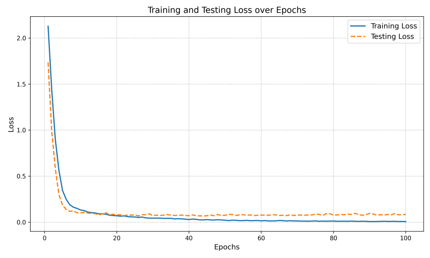

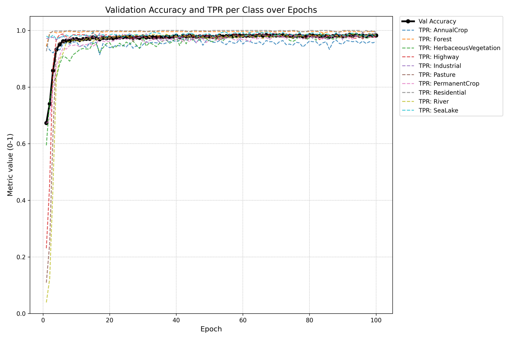

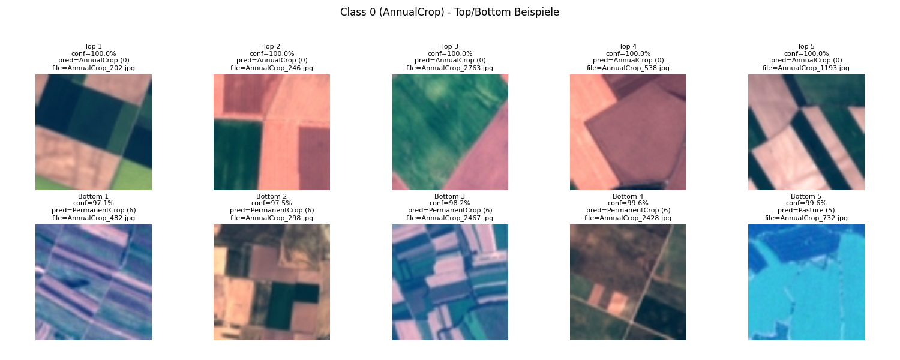

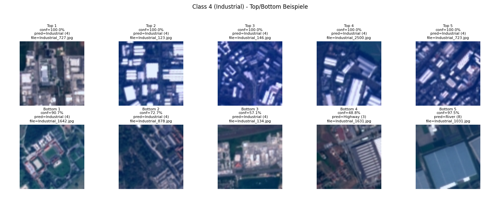

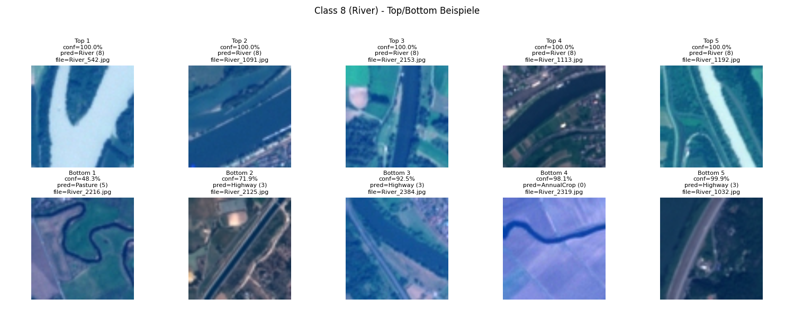


#### MS

##### Metrics

- accuracy: 97.1%
- avg_loss: 0.107948
- tpr_per_class:
  - 0 (AnnualCrop): 96.28%
  - 1 (Forest): 99.48%
  - 2 (HerbaceousVegetation): 95.63%
  - 3 (Highway): 95.74%
  - 4 (Industrial): 96.65%
  - 5 (Pasture): 93.94%
  - 6 (PermanentCrop): 94.29%
  - 7 (Residential): 99.51%
  - 8 (River): 99.2%
  - 9 (SeaLake): 98.97%

##### Config

```jsonc
{
  "seed": 3792567,
  "project_path": ".",
  "data_path": "./data/EuroSAT_MS",
  "data_source": "ms",
  "epochs": 100,
  "batch_size": 128,
  "workers": 8,
  "learning_rate": 1e-5,
  "weight_decay": 0.0001,
  "augmentation": ["strong"],
  "model": "resnet",
  "reproduction": false,
  "save_logits": false,
  "logits_path": "logits.pt",
  "model_path": "model.pth"
}
```


##### Graphs

.

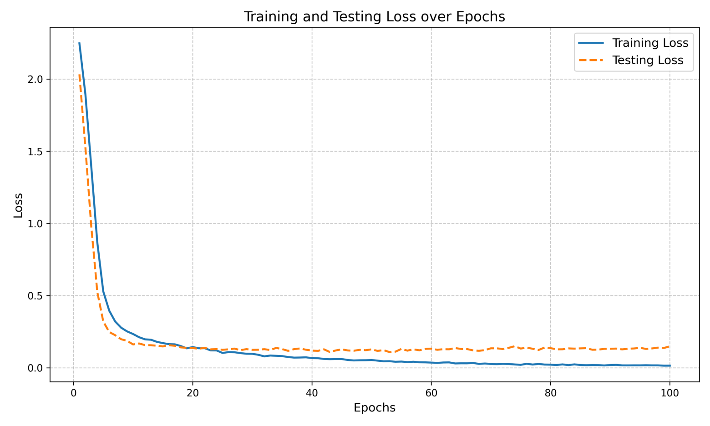

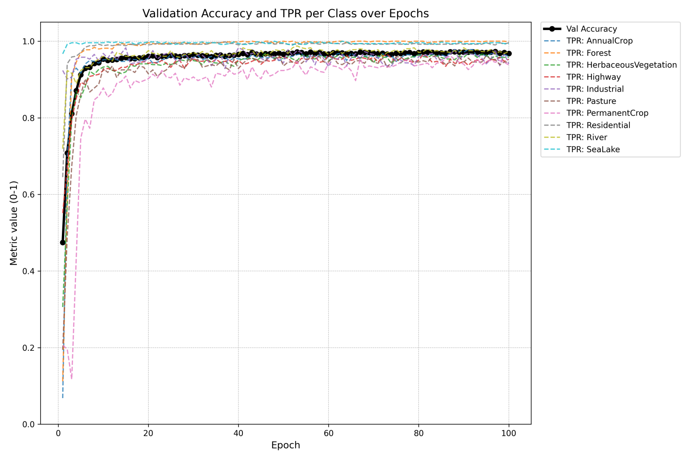

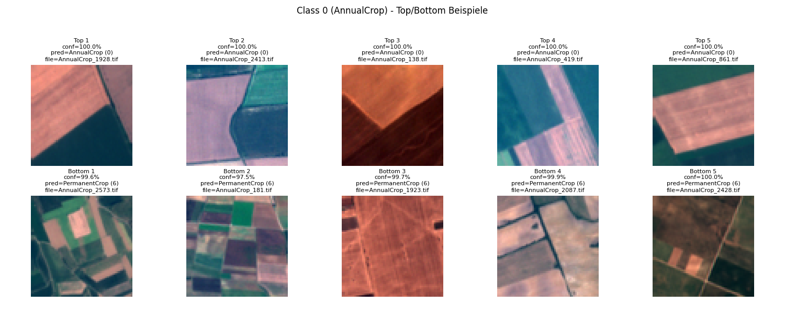

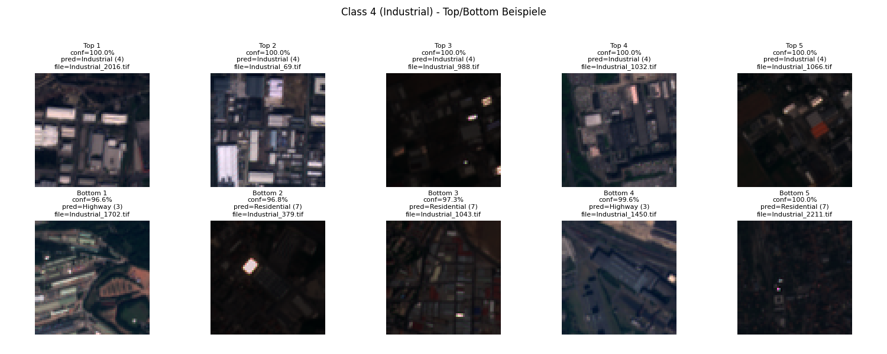

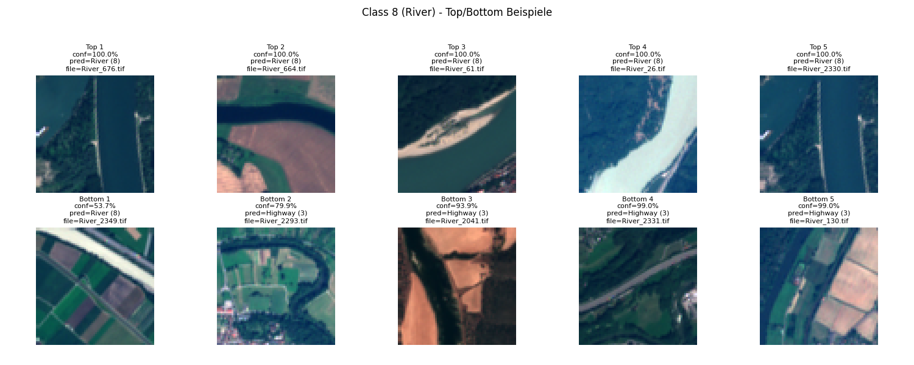


### Selfmade CNN

We also created our own network and trained it with RGB as well as with the MS data from scratch.

#### CNN-RGB

##### Config

```jsonc
{
  "seed": 3792567,
  "project_path": ".",
  "data_path": "./data/EuroSAT_RGB",
  "data_source": "rgb",
  "epochs": 500,
  "batch_size": 128,
  "workers": 8,
  "learning_rate": 1e-4,
  "weight_decay": 0.0001,
  "augmentation": ["strong"],
  "model": "cnn",
  "reproduction": false,
  "save_logits": false,
  "logits_path": "logits.pt",
  "model_path": "model.pth"
}
```


##### Graphs

.

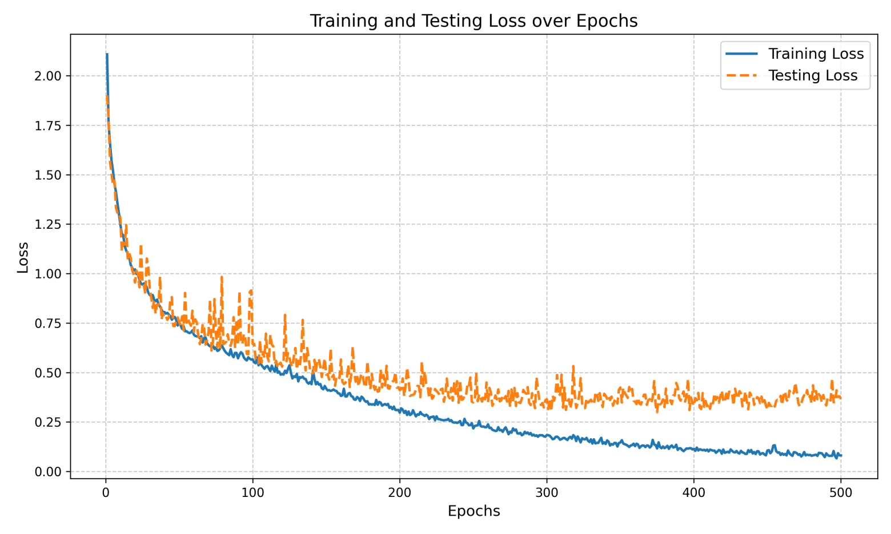

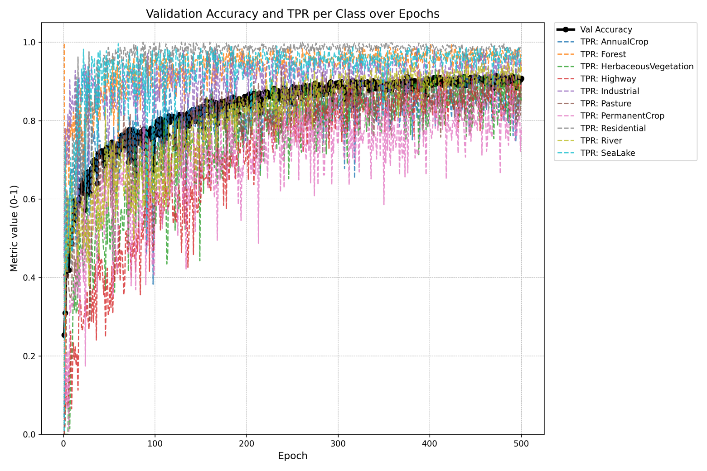

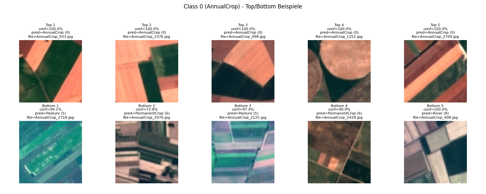

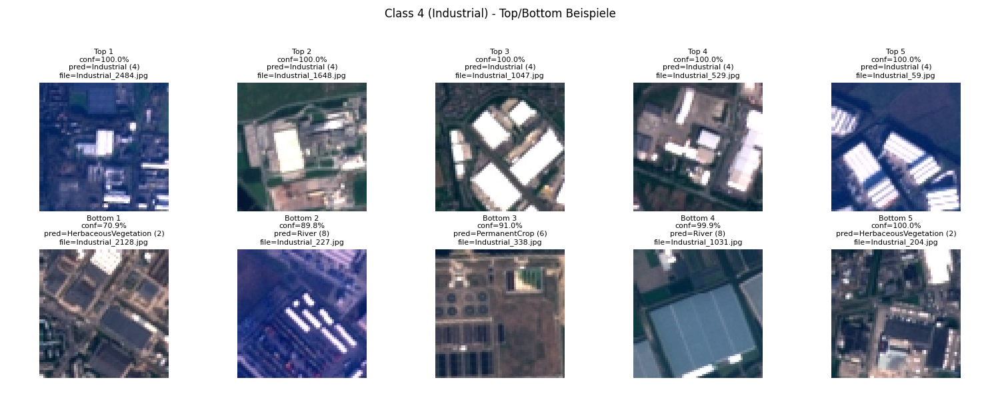

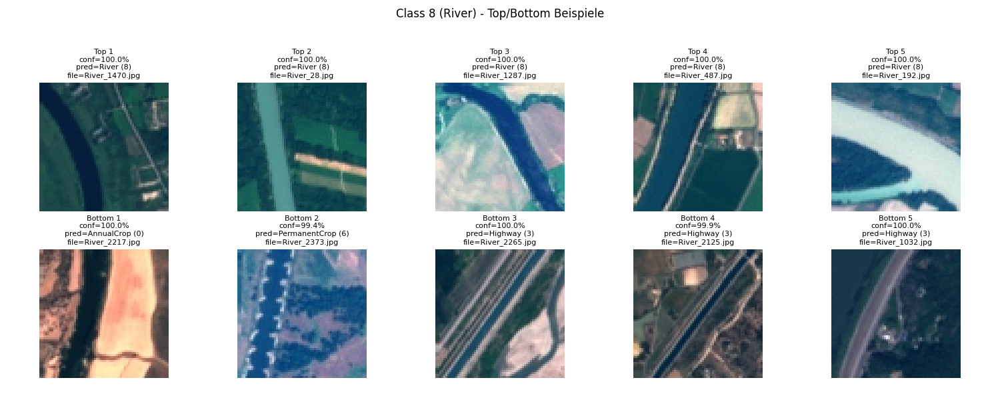


#### CNN-MS

##### Config

```jsonc
{
  "seed": 3792567,
  "project_path": ".",
  "data_path": "./data/EuroSAT_MS",
  "data_source": "ms",
  "epochs": 500,
  "batch_size": 128,
  "workers": 4,
  "learning_rate": 1e-4,
  "weight_decay": 0.001,
  "augmentation": ["strong"],
  "model": "cnn",
  "reproduction": false,
  "save_logits": false,
  "logits_path": "logits.pt",
  "model_path": "model.pth"
}
```


##### Graphs

.

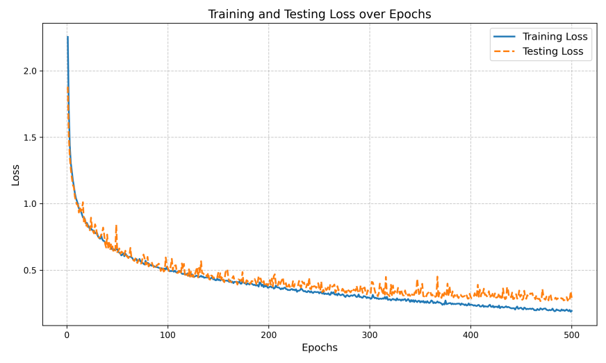

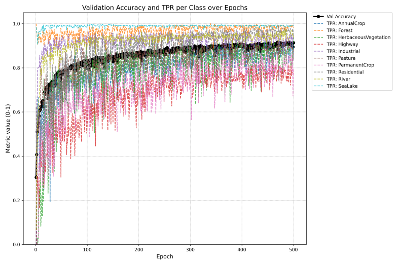


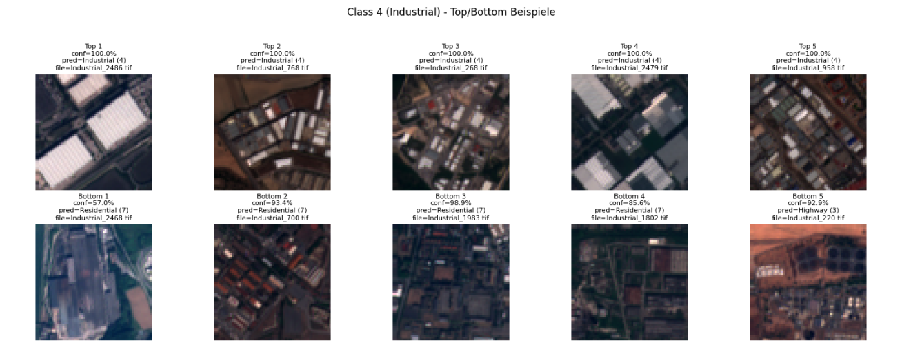

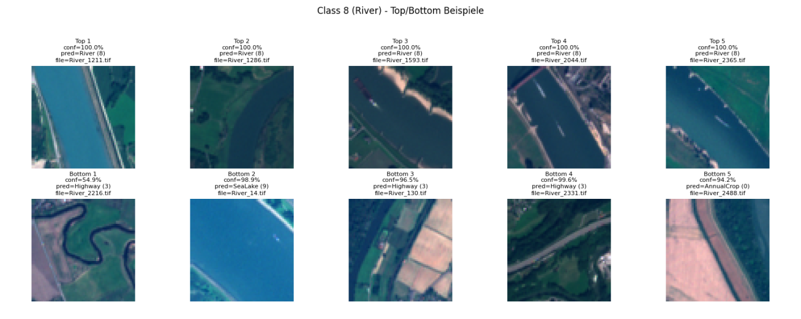


### Interesting Facts

| No augmentation | Strong augmentation |
|-----------------|---------------------|
| 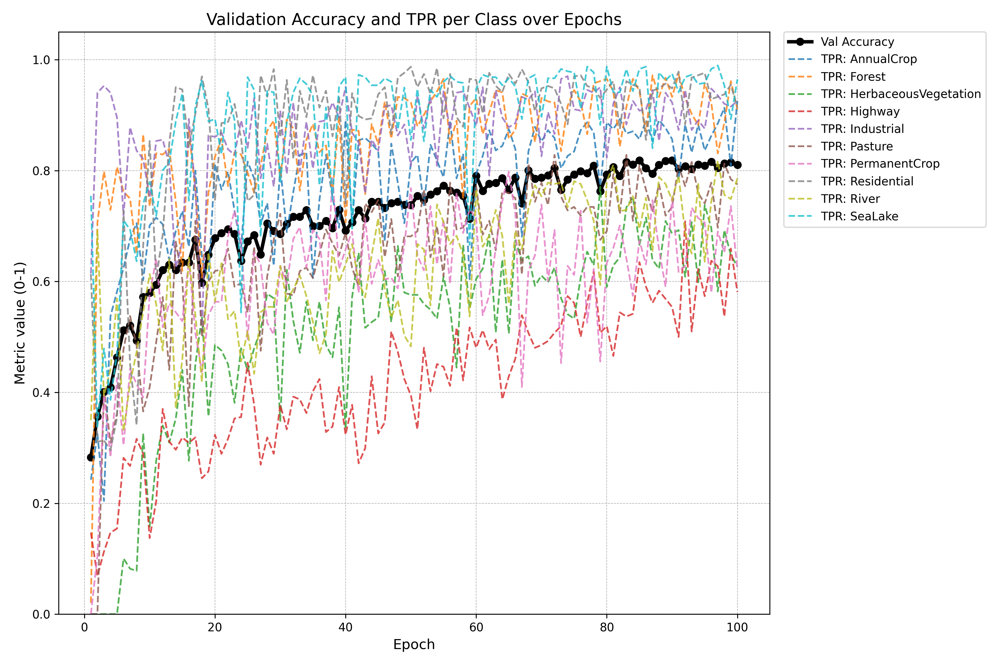{width=250px} | 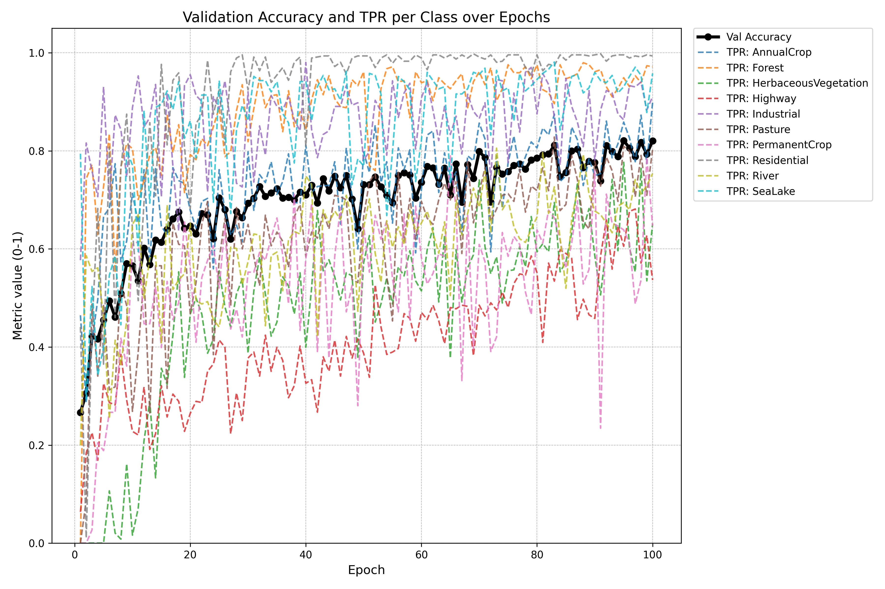{width=250px} |
| Scratch CNN with no augmentation on RGB | Scratch CNN with strong augmentation on RGB |

| Model | Accuracy | Size |
|-------|----------|------|
| Resnet-RGB | 98.4% | 46.49MB |
| Resnet-MS | 97.1% | 46.37MB |
| CNN-RGB | 91.5% | 1.10MB |
| CNN-MS | 90.5% | 1.12MB |

